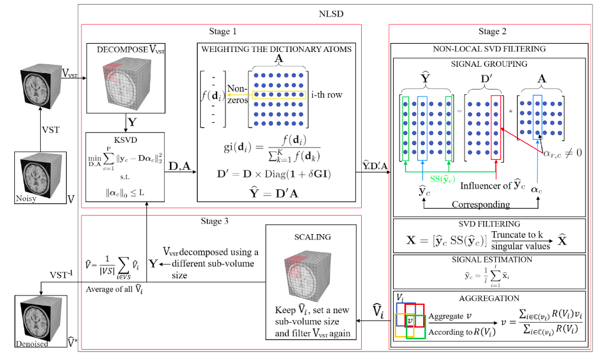
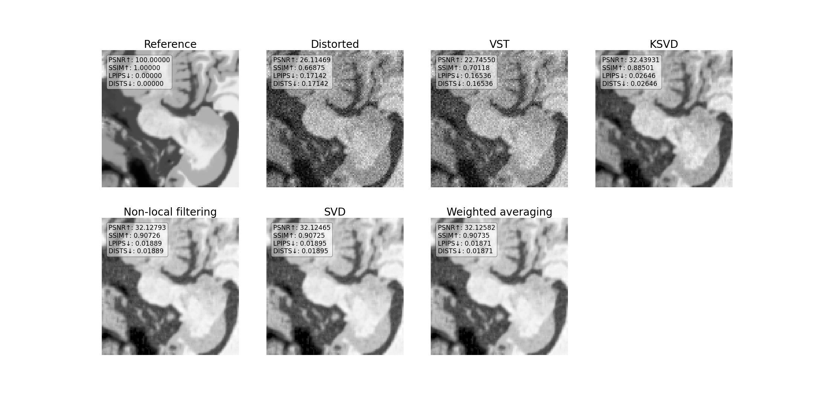
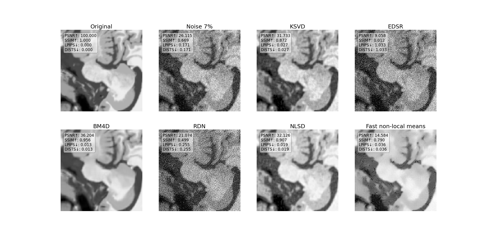

# sr-tomography
implementation of an algorithm for removing noise in tomography images taken as part of a linear algebra course at AI Masters

## Постановка задачи
Магнитно-резонансная томография (МРТ) - это метод получения 3D снимков внутренних органов за счет картирования времени спиновых релаксаций с присутствием шумовых компонент с распределением Райса (Rice distribution).

  

  
В нашей работе мы реализуем метод, представленный в статье [Non-Local SVD Denoising of MRI Based on Sparse Representations
](https://www.mdpi.com/1424-8220/20/5/1536/htm)

## Основные методы
В основе нашего алгоритма лежат 3 метода из теории вероятности и линейной алгебры:
1. Variance-Stabilization Transformation

  

   
2. KSVD matrix decomposition

  

  
3. None-local filtering

  

  
## Пайплайн
На рисунке ниже изображен весь пайплайн работы алгоритма

## Результаты работы алгоритма на каждом шаге
Промежуточный результат на каждом шаге представлен на рисунке ниже

## Сравнение с другими алгоритмами
Мы сравнили наш алгоритм с несколькими другими sota методами. Часть методов была упомянута в статье, другие методы мы взяли из бенчмарка [Super-Resolution on IXI
](https://paperswithcode.com/sota/super-resolution-on-ixi)

